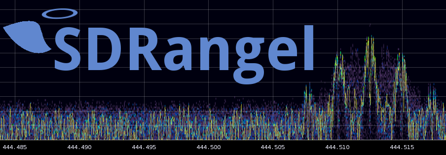

**SDRangel** is an open-source Qt5 / OpenGL 3.0+ SDR and signal analyzer frontend to various hardware.

**Discussion group**: You can ask other users for help or discuss subjects related to SDRangel and its ancillary projects [here](https://groups.io/g/sdrangel).

**Ancillary projects**

* [SDRangelcli](https://github.com/f4exb/sdrangelcli) is a web application that can be used to control a headless (server flavor) instance of SDRangel. It can also be used as a remote control for the GUI flavor.
* [SDRangel-Docker](https://github.com/f4exb/sdrangel-docker) is a collection of Docker files and scripts to facilitate building and running SDRangel in a Docker container. Works for either the GUI (only on a Linux host) or the server.

**Compile in Windows**

**Prerequisites**

* Install Visual Studio 2022 with Desktop development for C++ and MFC (Community edition is free - https://visualstudio.microsoft.com/vs/community/)

* Install Qt 5.15.2 or 6.7+ (including optional Qt Charts WebEngine for 5.15.2 and Qt Charts, StateMachine, Qt5Compat, Location, Multimedia, Positioning, SerialPort, ShaderTools, Speech, WebSockets and WebEngine for 6.7+ - WebEngine is under Extensions, not Additional Libraries for 6.8+) for MSVC 2019 64-bit or MSVC 2022 64-bit for 6.8 (https://www.qt.io/download-open-source)
* Install Boost (https://www.boost.org/users/download/), but this will not allow to compile UHD(USRP). It's better to install (C:\local\uhd) UHD libs and use them during compilation (https://github.com/EttusResearch/uhd/releases)
* Install ninja (https://ninja-build.org/) - May also be installed with Qt
* Install cmake (https://cmake.org/download/) - May also be installed with Visual Studio or Qt
* Install git (https://git-scm.com/download/win)
* Install NSIS (https://nsis.sourceforge.io/Download)
* Make sure git, cmake, nsis and ninja are in your PATH environment variable.
* Optionally install CUDA Toolkit 12.6 https://developer.nvidia.com/cuda-downloads and check CUDA_PATH points to the install

**Compile and Build (cmd line)**
Run Visual Studio shell: `Start > Visual Studio 2022 > x64 Native Tools Command Prompt for VS 2022` Then:
```
cd %userprofile% (or wherever you want to build that has 10GB free space)
git clone https://github.com/f4exb/sdrangel.git
cd sdrangel
git submodule update --init --recursive
mkdir build
cd build
cmake -Wno-dev -G Ninja -DCMAKE_BUILD_TYPE=Release -DRX_SAMPLE_24BIT=ON -DENABLE_QT6=ON -DCMAKE_PREFIX_PATH="C:\local\uhd;C:\Qt\6.9.1\msvc2022_64" ..
ninja
ninja package
```

This will build the installer .exe

If you do not need support for some SDRs (or you have problems building their libraries), they can be disabled individually with `-DENABLE_BLADERF=OFF -DENABLE_IIO=OFF -DENABLE_MIRISDR=OFF` ... etc.

To build with Qt 6, use `-DCMAKE_PREFIX_PATH=C:\Qt\6.7.3\msvc2022_64` and `-DENABLE_QT6=ON`.

After an initial build of `ninja package`, rather than repeatedly building the installer, you can run SDRangel from the build directory, by just running `ninja` to rebuild then '.\bin\sdrangel' to run.

Passing `-DCMAKE_BUILD_TYPE=Debug` or `-DCMAKE_BUILD_TYPE=RelWithDebInfo` (lighter but may be less precise) to the cmake command will create a version that is easier to debug for yourself or the maintainers.

Passing `-DHIDE_CONSOLE=OFF` will enable debug output (qDebug()) to the command prompt.